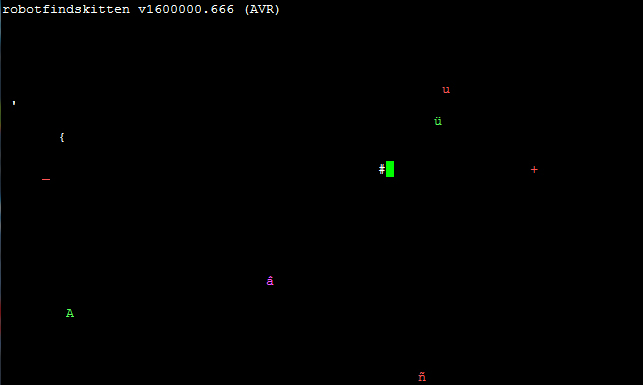

RobotFindsKitten for Arduino
===

Helping robots find kittens, now on Arduino!

## How to play

Open using Arduino IDE and upload to Arduino.   
On Windows use <a href="http://www.chiark.greenend.org.uk/~sgtatham/putty/" target="_blank">Putty</a> to connect, set mode to serial and connect to corresponding COM port at rate 9600.   
On Linux run `screen /dev/ttyACM0 9600` (replace ttyACM0 with port connected to Arduino).

Make sure the window is at least 80x28 lines!

## Credits

Based on robotfindskitten AVR port by Daniel Beer.   
http://robotfindskitten.org/download/AmtelAVR/  

Original robotfindskitten by Leonard Richardson.   
http://robotfindskitten.org/
 
